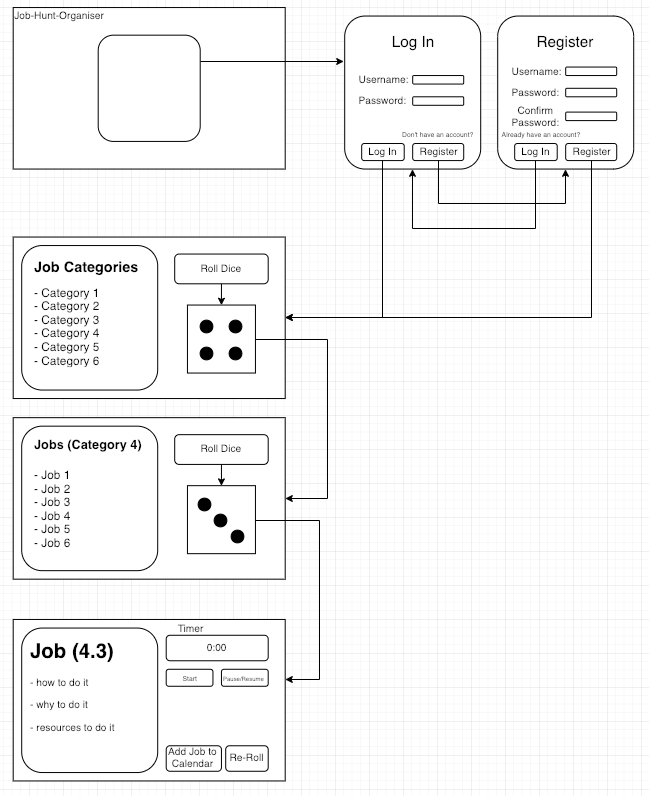

# Job Hunt Organiser
Take the some of the decision making out of job hunting. Job Hunt Organiser
will randomly assign you activities to do to help you attain a job.

[](http://waffle.io/LazySamir/job-hunt-organiser)

[](https://travis-ci.org/LazySamir/job-hunt-organiser)

### Requirements
- able to create an account
- able to log in
- able to set activities to role for
- click a button to randomly choose an activity
- connect with google calendar
- automatically fill in google calendar with randomly selected activity
- view total and individual hours worked on activities

### User Stories
```
As a user
So I can use the service
I want to be able to create an account

As a user
So I can personalise the service
I want to be able to log in to my account

As a user
So I can organise my disorganised life after Makers
I want to be given a selection activities to complete

As a user
So I can I do not get bored
I want there to be multiple activities to complete

As a user
So I do not have to think
I want the activities to be randomised at the click of a button

As a user
So I have some control of the activities
I want to be able to select and deselect certain activities

As a user
So I can set the time I spend on each activity
I want to be able to set the time I will dedicate to it

As a user
So I can keep track of what I have completed
I want there to be a record of my day to day activities

As a user
So I do not have to log in everytime to check my selected activities
I want the activities to be added to my calender
```

### User Flow/Mockups



### Activity Categories

#### Jobhunting
1. Sign up to hired (with this link) and talent.io. If you've done all that see my previous email about jobs-board and have a look at one you haven't used before.
2.  Build a list of jobs you want to apply to on your huntr board and then start an application.
3. Build a list of dream companies you'd love to work for. Check out their careers page and LinkedIn, there might be Makers there. If you know there's an office in London ask the careers team who might know something about the process. Looking at the work histories of previous Makers is a good place to get ideas for your list and then you can contact that Maker. Obvs. 
4. Find a job you're into and instead of writing an application, call them up and ask to speak to the engineering team to find out more before you apply. Do some research before you apply to help you build rapport. Explain you're a boot camp grad but would love to apply, ask them what they're working on now. 
5. Connect with a CTO you admire on LinkedIn even though there is no job advertised. 
6. Watch this Vid by our COO Ruben. It's 20 minutes and it's fun.


#### Programming
1. Keep working on a side project, or start one, or listen to this podcast or 10X the hell out of this suggestion and create your own portfolio website.
2. Start or keep working on a week 10 tech test
3. Message us all in _jobhunters to find out if anyone wants to pair with you.
4. Take an hour to read some tech blogs or a book
5. Take an hour to practice answering technical questions
6. Go over the Makers course and remind yourself of key concepts


#### Market Yourself
1. Update your LinkedIn page and connect with 100+ Makers
2. Start a blog post. If you're new to blogging, Medium is good. Start with the story of your journey to becoming a software engineer. Something like Angela's here.
3. Work on a CV to use for jobs you apply to outside of Makers
4. Check your Github profile looks good to employers
5. Head to MeetUps or check out Eventbrite and sign up to tech events or hackathons. Summary of events here but keep your eye on our events channel.
6. Reach out to a dev or someone on LinkedIn or Maker's alumni slack and offer to take them out for coffee in exchange for some guidance, a CV review and guidance to help you choose the right place to work. Listen to what they have to say about their own career journey. In Alumni Slack, we have a slack channel called coffee_buddies where you're paired with a Maker alumni every two weeks. 


#### Self Care & Self Management
1. Meditate
2. Take yourself out for lunch today
3. Do some exercise, 30 mins of yoga or go for a walk
4. Use Pomodoros to give yourself plenty of breaks. Be gentle. Write a list of things you want to get done tomorrow at the end of the day.
5. Call someone from your cohort or slack them to see how they're doing.  Hearing from you will make anyone happy!
6. Do something you enjoy that has zero to do with coding or job-hunting for at least an hour. 
